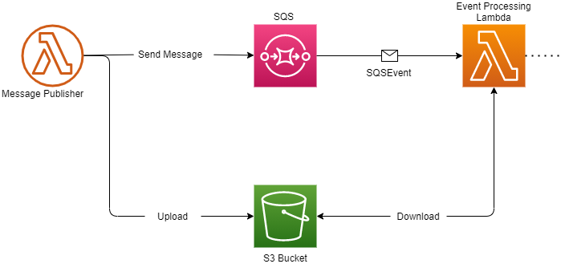

# Amazon Development Tools

## Legal notice

Code & Opinions expressed in this repository are solely my own and do not express the views or opinions of my employer. This code is not supported by any employer as well as not profitable and do not bring any financial benefits. All work that was done during its creation was conducted in my spare/personal time and based only on my willingness to help the open-source community.

## About

This repository contains useful extensions of packages provided by Amazon Dev Teams for better software engineering and application creating.

## Overview

#### Lambda.SQSEvents.S3Support

[Lambda.SQSEvents.S3Support](https://github.com/SerhiiVoznyi/Amazon-Development-Tools/Lambda.SQSEvents.S3Support) - Provides support for large message payload throws calls to Amazon S3 bucket. This is part of approach for handling SQS Messages with huge message body such as in [Amazon.SQS.ExtendedClient](https://github.com/raol/amazon-sqs-net-extended-client-lib). 





```c#
IAmazonS3 s3Client; // S3 Client with access to bucked used as sqs store.
IS3SQSEventBridge s3Bridge = new S3SQSEventBridge(s3Client);
var sqsEventUpdated = await sut.UpdateMessagesPayloadAsync(sqsEvent);
```


